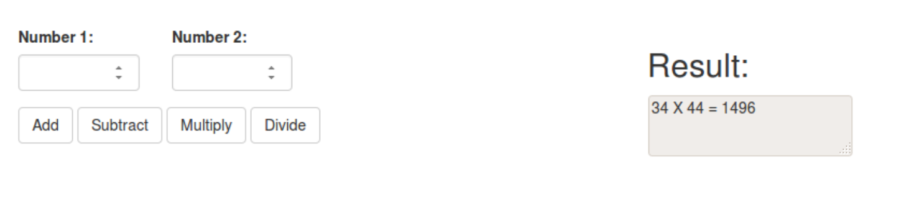

# Pazien Frontend Project

## About
Welcome to the Pazien frontend project. The purpose of this project is to gauge your ability to work with React.  

Upon completion, please either:
- Clone this repo to a **private** repo and invite [Alexandr Grinevich](https://github.com/grinyahoo) as a collaborator.
- Zip your solution and email it to [Alexandr Grinevich](mailto:alexandr.grinevich@pazien.com)

> Hey this is important! We hope you can spend from two to five hours on this project. If you can finish faster - great! If not, limit yourself and don't spend much longer than five hours MAX.

This project was bootstrapped with [Create React App](https://github.com/facebook/create-react-app).

## Setup

First clone this repo and `cd` into the directory in your terminal.

Next install the dependencies with npm:

### `npm install`

In the project directory, you can run:

### `npm start`

Runs the app in the development mode. 
Open [http://localhost:3000](http://localhost:3000) to view it in the browser.

The page will reload if you make edits. 

### `npm test`

Checks for any lint errors and then launches the test runner in the interactive watch mode. 
See the section about [running tests](https://facebook.github.io/create-react-app/docs/running-tests) for more information.

## Instructions

Your task is to create a calculator.

It can be as simple as two input boxes with a few buttons for actions:  
 
 

Or as complex as [NumWorks graphing calculator](https://www.numworks.com/simulator/): 

  
Put your solution inside a div located https://github.com/grinyahoo/pazien-test/blob/master/src/App.js#L17

## What exactly are we trying to achieve with this task?

#### Put you under time pressure.
You decide the best features for your minimum viable product (MVP).

#### Evaluate your React and JavaScript skills
We love cutting-edge standards and the best code design principles.
Are you a fan of React Hooks, Flux, class instance state, HOC, or maybe decide to add Redux to the project?

#### Check your codding style. 
We included a short version of our ESLint config in this repo. Feel free to run it against your code with `npm test`

#### Make sure you are familiar with GitHub, NPM, Node.js and other modern services/tools 
We use GitHub for code version control, code reviews, release tracking, issue management, and many other things.  

## Having technical issues?
Send me an email at [alexandr.grinevich@pazien.com](alexandr.grinevich@pazien.com)
